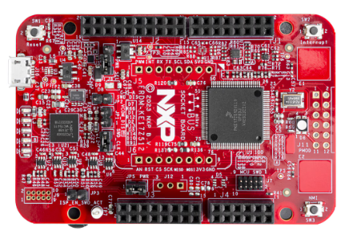
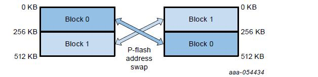
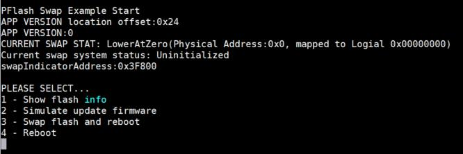
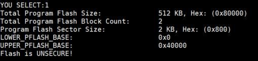
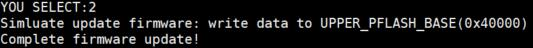
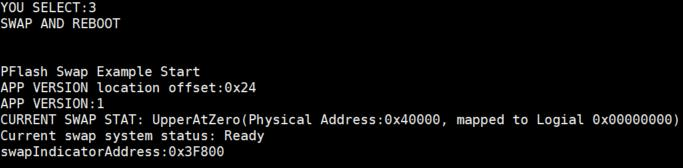
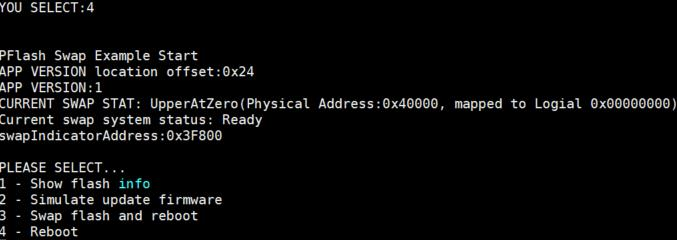

# NXP Application Code Hub
  

## AN14165:Flash Memory Swap Feature on KE17Z512

This application note describes how to use flash swap feature on KE17Z512 series.

The flash swap function, which is accessible on certain Kinetis microcontroller components, serves as a strong tool for dependable software enhancements. This application note discusses how to employ the swap feature effectively. Frequently asked queries are responded to, and a practical use case is illustrated.
This application note is aimed at system coders who are building applications that can apply the flash swap feature.

Please refer to AN14165 for complete instructions on how to use this software.  
[https://www.nxp.com.cn/docs/en/application-note/AN14165.pdf](https://www.nxp.com.cn/docs/en/application-note/AN14165.pdf)

#### Boards: FRDM-KE17Z512
#### Categories: Industrial, Memory
#### Peripherals: FLASH
#### Toolchains: MDK

## Table of Contents
1. [Software](#step1)
2. [Hardware](#step2)
3. [Setup](#step3)
4. [Results](#step4)
5. [FAQs](#step5) 
6. [Support](#step6)
7. [Release Notes](#step7)

## 1. Software
The development environment of example code is development on:

- MCUXpresso IDE v24.9 [Build 25] [2024-09-26]
- SDK 2.16 FRDM-KE17Z512, can be downloaded here:[https://mcuxpresso.nxp.com/en/builder?hw=FRDM-KE17Z512](https://mcuxpresso.nxp.com/en/builder?hw=FRDM-KE17Z512)  
- serial terminal: MobaXterm V11.0

## 2. Hardware  

- [FRDM-KE17Z512](https://www.nxp.com/design/design-center/development-boards-and-designs/general-purpose-mcus/frdm-development-board-for-96-mhz-ke17z-ke13z-ke12z-with-512-kb-flash-mcus:FRDM-KE17Z512) Development Board  

  
&emsp;&emsp; &emsp;&emsp;&emsp;&emsp;&emsp;&emsp;&emsp;&emsp;&emsp;&emsp;FRDM-KE17Z512

- USB cable
- Personal Computer  

## 3. Setup
1. KE17Z512 Flash has a total size of 512KB, divided into 2 physical Blocks, each of 256KB, with a sector size of 2K.
2. Physical address: 0x00000 - 0x40000 (0-256K) is called LB (Lower Block).
3. Physical address: 0x40000 - 0x80000 (256K - 512K) is called UB (Upper Block).
4. Logical address: the address as perceived by the CPU. If there is no   function, then the logical address is the same as the physical address.

The meaning of Flash Swap is that the user can execute an operation to map the logical address to the LB or UB.  

-  For instance, by default, the code resides in the LB region starting from address 0, and the logical address is also 0.

* Once a swap is initiated, upon the next startup, the logical address 0 is already mapped to UB (Physical: 0x40000). As far as the CPU is concerned, the address 0 that the CPU sees is already the physical address (0x40000).

* If the SWAP is executed again, it will switch back, ping-pong each other, and so on.

## 4. Results
After burning the code to the board, connect the serial port and press reset, the following will be printed:

In which `CURRENT SWAP STAT: LowerAtZero(Physical Address:0x0, mapped to Logical 0x00000000)` indicates that the current CPU's logical address is mapped to physical address: 0x00000000 (equivalent to no Flash Swap).

1. Enter 1: It will print the basic information of Flash.  

2. Enter 2: Simulate firmware upgrade behavior, which is actually copying the entire LB IMAGE to UB, only incrementing by 1 at the APP_VERSION location.  

3. Enter 3: Enable Flash Swap and reboot (takes effect), APP_VERSION is incremented to 1 and physical address(0x40000) is mapped to logical address(0x00000000)   

4. Enter 4: Reboot.  

## 5. FAQs
No FAQs have been identified for this project.

## 6. Support

#### Project Metadata
<!----- Boards ----->

<!----- Categories ----->
 

<!----- Peripherals ----->

<!----- Toolchains ----->

Questions regarding the content/correctness of this example can be entered as Issues within this GitHub repository.

>**Warning**: For more general technical questions regarding NXP Microcontrollers and the difference in expected funcionality, enter your questions on the [NXP Community Forum](https://community.nxp.com/)

## 7. Release Notes
| Version | Description / Update                           | Date                        |
|:-------:|------------------------------------------------|----------------------------:|
| 1.0     | Initial release on Application Code Hub        | April 9th 2024 |

<small> <b>Trademarks and Service Marks</b>: There are a number of proprietary logos, service marks, trademarks, slogans and product designations ("Marks") found on this Site. By making the Marks available on this Site, NXP is not granting you a license to use them in any fashion. Access to this Site does not confer upon you any license to the Marks under any of NXP or any third party's intellectual property rights. While NXP encourages others to link to our URL, no NXP trademark or service mark may be used as a hyperlink without NXP’s prior written permission. The following Marks are the property of NXP. This list is not comprehensive; the absence of a Mark from the list does not constitute a waiver of intellectual property rights established by NXP in a Mark. </small>   <small> NXP, the NXP logo, NXP SECURE CONNECTIONS FOR A SMARTER WORLD, Airfast, Altivec, ByLink, CodeWarrior, ColdFire, ColdFire+, CoolFlux, CoolFlux DSP, DESFire, EdgeLock, EdgeScale, EdgeVerse, elQ, Embrace, Freescale, GreenChip, HITAG, ICODE and I-CODE, Immersiv3D, I2C-bus logo , JCOP, Kinetis, Layerscape, MagniV, Mantis, MCCI, MIFARE, MIFARE Classic, MIFARE FleX, MIFARE4Mobile, MIFARE Plus, MIFARE Ultralight, MiGLO, MOBILEGT, NTAG, PEG, Plus X, POR, PowerQUICC, Processor Expert, QorIQ, QorIQ Qonverge, RoadLink wordmark and logo, SafeAssure, SafeAssure logo , SmartLX, SmartMX, StarCore, Symphony, Tower, TriMedia, Trimension, UCODE, VortiQa, Vybrid are trademarks of NXP B.V. All other product or service names are the property of their respective owners. © 2021 NXP B.V. </small>